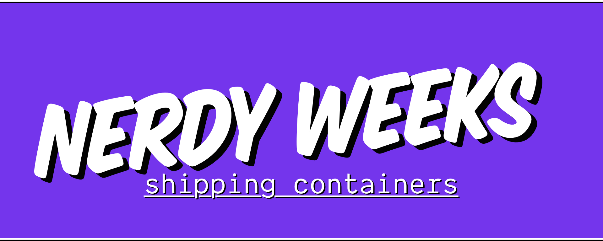

 

# Nerdy Weeks - Shipping Containers

## Prerequisites

- git v2 or greater
- NodeJS v10 or greater
- npm v6 or greater
- VSCode latest
- docker v19 or greater
  
Test if they exists - fix it if they don't.

```bash
git --version
node --version
npm --version
code --version
docker --version
```

## Setup

```bash
git clone git@github.com:technologiestiftung/nerdy-weeks-shipping-containers.git
cd nerdy-weeks-shipping-containers
```

You will find details in the folders `./exercises/**`